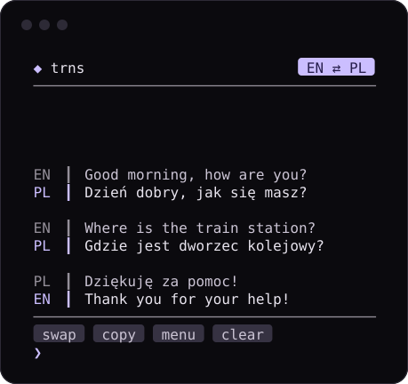

<div align="center">

```
 _
| |_ _ __ _ __  ___
| __| '__| '_ \/ __|
| |_| |  | | | \__ \
 \__|_|  |_| |_|___/
```

### Translate without leaving the terminal.

A tiny, **mobile-first** terminal translator. Tap to swap languages, tap to copy.<br>
No API key. No account. No dependencies.

[](LICENSE)
[](https://www.python.org/)
[](requirements.txt)
[](#install)
[](#development)

[**Install**](#install) &nbsp;·&nbsp; [**Controls**](#controls) &nbsp;·&nbsp; [**Website**](site/) &nbsp;·&nbsp; [**Contribute**](CONTRIBUTING.md) &nbsp;·&nbsp; [**Changelog**](CHANGELOG.md)

<br>



<sub>Rendered from the real UI code at 42 columns - the width of a phone in portrait.</sub>

</div>

<br>

## Why trns

Most terminal translators assume a wide window and a hardware keyboard. trns
starts from the opposite end: a phone running [Termux](https://termux.dev),
portrait orientation, soft keyboard open (that can be **40 columns by 10
rows**). Everything else is that layout with more room.

- **Tap targets** - the language chip swaps direction, history cards copy,
  action buttons open settings. Soft keyboards have no <kbd>Tab</kbd>; you
  don't need one.
- **Never wraps** - the input line scrolls sideways, so a long sentence can't
  corrupt the screen.
- **Adapts live** - three responsive breakpoints; rotate your phone or resize
  the window and it re-lays out instantly.
- **Search-as-you-type language picker** - by number, code (`pl`) or name
  (`pol`).
- **Scriptable** - `trns hello` prints a card; piped, it prints *only* the
  translation.
- **Zero dependencies** - the Python 3.9+ standard library, nothing else.
- **Polite** - honours [`NO_COLOR`](https://no-color.org), falls back to ASCII
  glyphs (`TRNS_ASCII=1`), and never writes translations to disk.

## Install

**Linux · macOS · WSL · Termux**

```bash
curl -fsSL https://raw.githubusercontent.com/Inpriv/labs/trns/pwa/tools/trns/install.sh | bash
```

**Windows** (PowerShell)

```powershell
irm https://raw.githubusercontent.com/Inpriv/labs/trns/pwa/tools/trns/install.ps1 | iex
```

Then open a **new terminal** and run `trns`.

<details>
<summary><b>What the installers do</b> &nbsp;·&nbsp; options, offline installs, other branches</summary>

<br>

- **`install.sh`** detects your distro, installs `python3` if it's missing,
  puts the sources in `~/.local/share/trns/`, creates a launcher at
  `~/.local/bin/trns` (`$PREFIX/bin/trns` on Termux) and **asks** before it
  touches your PATH.
- **`install.ps1`** needs no admin rights: it installs to
  `%LOCALAPPDATA%\trns`, finds a working Python 3.9+, and adds the folder to
  your *user* PATH.
- Both verify the install by running `trns --version` before they finish, and
  both are safe to re-run to update.

| Want to…                    | Linux / macOS / Termux                          | Windows                                   |
|-----------------------------|-------------------------------------------------|-------------------------------------------|
| skip the PATH change        | `… \| bash -s -- --path-skip`                   | `-NoPath` *(see below)*                   |
| add to PATH without asking  | `… \| bash -s -- --path-add`                    | *(default)*                               |
| update                      | `… \| bash -s -- --update`                      | re-run the one-liner                      |
| uninstall                   | `… \| bash -s -- --uninstall`                   | `-Uninstall` *(see below)*                |
| install a different branch  | `TRNS_REF=main … \| bash`                       | `-Ref main`                               |
| install from a local clone  | `TRNS_SRC=./tools/trns bash install.sh`         | `-Source .\tools\trns`                   |

PowerShell flags need the script-block form:

```powershell
& ([scriptblock]::Create((irm https://raw.githubusercontent.com/Inpriv/labs/trns/pwa/tools/trns/install.ps1))) -NoPath
```

Prefer to read before you run? Download the script first, inspect it, then
execute it - or skip the installers and run `python trns.py` from a checkout.

</details>

### Try it

```bash
trns                           # interactive
trns hello world               # English -> Polish (default)
trns --swap cześć              # reverse direction
trns --from pl --to en cześć   # explicit languages
```

> **Termux tip:** `pkg install termux-api` (plus the Termux:API app) enables
> one-tap copy. Without it trns falls back to the OSC 52 escape sequence.

## Controls

| Touch / mouse            | Keyboard                          | Action                     |
|--------------------------|-----------------------------------|----------------------------|
| tap the **language chip**| <kbd>Tab</kbd>                    | swap source ⇄ target       |
| tap a **history card**   | `/copy` (most recent)             | copy that translation      |
| tap **menu**             | `/settings`                       | languages & PATH           |
| tap **clear**            | <kbd>Ctrl</kbd>+<kbd>L</kbd>      | clear history              |
| swipe / wheel            | <kbd>PgUp</kbd> <kbd>PgDn</kbd> <kbd>↑</kbd> <kbd>↓</kbd> | scroll back |
| tap the input line       | <kbd>←</kbd> <kbd>→</kbd> <kbd>Home</kbd> <kbd>End</kbd> | move the cursor |
| -                        | <kbd>Enter</kbd>                  | translate                  |
| -                        | <kbd>Ctrl</kbd>+<kbd>C</kbd>      | exit                       |

Slash commands: `/swap` `/copy` `/settings` `/path` `/clear` `/help` `/quit`.

## Command line

```text
trns                            interactive REPL
trns hello world                one-shot translation
trns --swap cześć               one-shot, reversed direction
trns --from pl --to en cześć    explicit source + target
trns --settings                 open the settings menu
trns --path-add | --path-remove add / remove this folder on PATH, then exit
trns --where                    print install + config paths
trns --version                  print version
trns --color always|never|auto  control ANSI colour
trns --debug-input=keys.log     log raw key bytes (Termux keyboard debugging)
```

| Environment   | Effect                                   |
|---------------|------------------------------------------|
| `NO_COLOR`    | disable colour                           |
| `TRNS_ASCII=1`| ASCII glyphs instead of Unicode          |
| `TRNS_HOME`   | relocate the config directory            |

## Configuration

Stored at `~/.trns/config.json` (`%USERPROFILE%\.trns\config.json` on Windows):

```json
{
  "version": 1,
  "first_run_done": true,
  "path_opt_in": true,
  "path_dir": "/home/you/.local/share/trns",
  "source": "en",
  "target": "pl"
}
```

Edit it directly or use `/settings`. UTF-8, two-space indent, no BOM.

## Project website (installable PWA)

[`site/`](site/) is a single static page - no build step - with a live demo of
the interface. It ships a web manifest and a service worker, so it can be
added to a phone's home screen and works offline. It is live at **[trns.inpriv.xyz](https://trns.inpriv.xyz)**, served by the
Cloudflare Worker in [`worker/`](worker/) (`npx wrangler@4 deploy`). Any static
host works too:

```bash
python -m http.server -d site 8080     # preview at http://localhost:8080
```

## How it's built

```
trns/
├── trns.py            CLI entry point, first-run wizard, argument parsing
├── install.sh         Linux / macOS / Termux installer
├── install.ps1        Windows installer (PowerShell one-liner)
├── install.bat  trns.bat  uninstall.bat      Windows helpers (from a checkout)
├── core/
│   ├── translator.py  urllib client for translate.googleapis.com
│   ├── config.py      JSON config + cross-platform PATH handling
│   ├── theme.py       glyph sets + responsive layout breakpoints
│   ├── view.py        pure rendering: frames, cards, tap targets
│   ├── keys.py        raw keyboard / mouse input parser
│   ├── ui.py          REPL, line editor, settings, language picker
│   ├── direction.py   source -> target value object
│   ├── clipboard.py   cross-platform copy
│   └── utils.py       colour tokens + language registry
├── tests/             stdlib unittest, no network
├── site/              project website + PWA (served at trns.inpriv.xyz)
├── worker/            Cloudflare Worker that serves site/ (wrangler.jsonc)
└── docs/              README assets
```

The rendering layer (`view.py`) never touches the terminal: it turns state
into strings and tap rectangles. That is what makes the interface testable -
the suite asserts that **no line is ever wider than the screen** across
eleven sizes from 24 to 102 columns.

## Development

```bash
python -m unittest discover -s tests -t .    # 41 tests, no network
```

Read [CONTRIBUTING.md](CONTRIBUTING.md) first: zero runtime dependencies,
mobile first, and every touch action needs a keyboard equivalent.

## Privacy & limits

- Text you translate is sent to Google's **public, unofficial** web endpoint
  (`translate.googleapis.com`) and nowhere else. It may rate-limit or change
  without notice and offers no guarantees beyond Google's own. **Don't send
  secrets.**
- trns keeps no history on disk; only the small config file above.
- Input is capped at 4,500 characters per request.
- A quick connectivity probe runs at startup; offline you still get a warning
  and a working settings menu.
- Vulnerabilities: see [SECURITY.md](SECURITY.md).

## Uninstall

```bash
curl -fsSL https://raw.githubusercontent.com/Inpriv/labs/trns/pwa/tools/trns/install.sh | bash -s -- --uninstall
```

```powershell
& ([scriptblock]::Create((irm https://raw.githubusercontent.com/Inpriv/labs/trns/pwa/tools/trns/install.ps1))) -Uninstall
```

Both remove the install directory, launcher, `~/.trns` (your config), and the
PATH entry.

## License

[MIT](LICENSE) - part of the [Inpriv Labs](https://github.com/Inpriv/labs) family
of privacy-first tooling.
